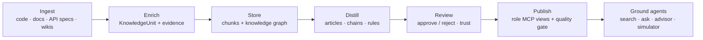
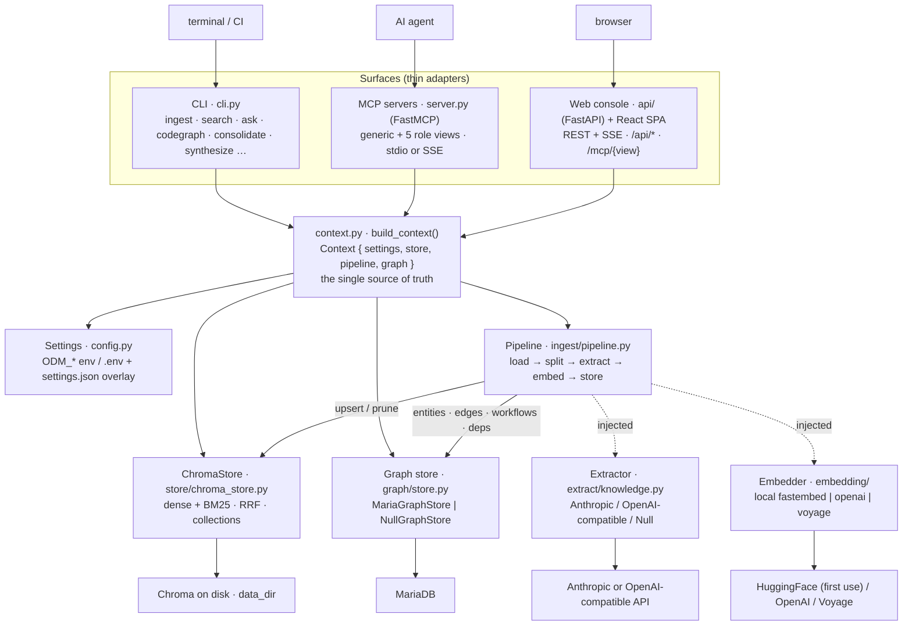
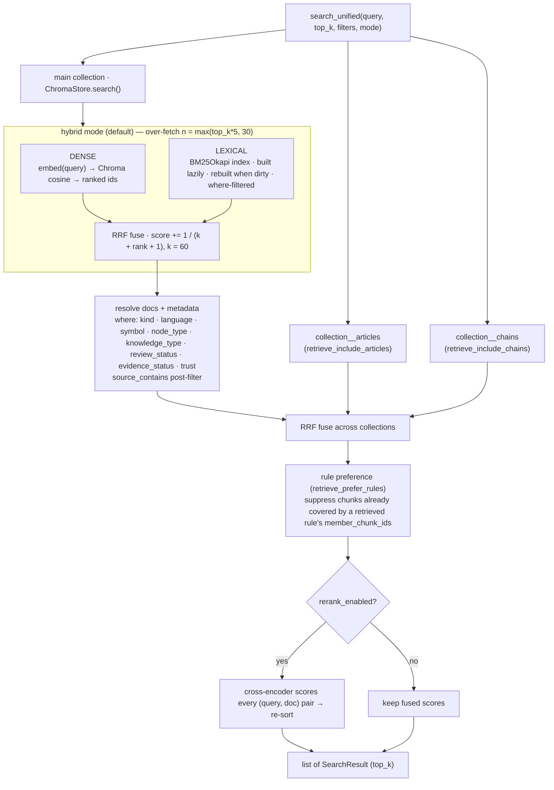
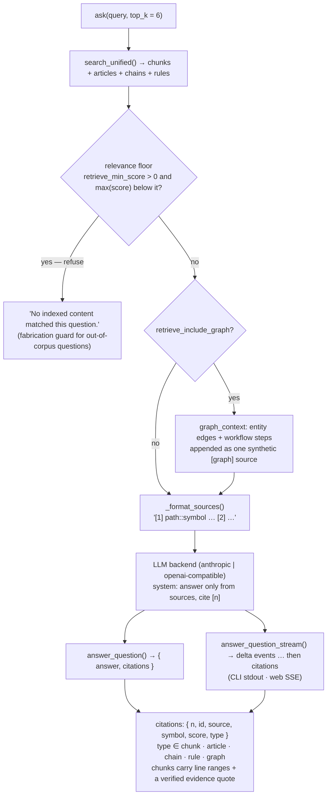
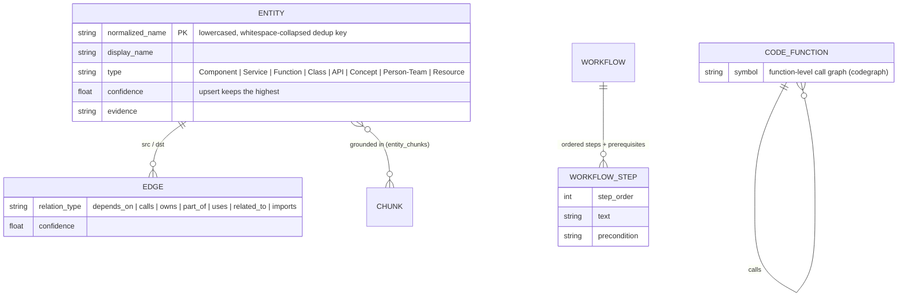
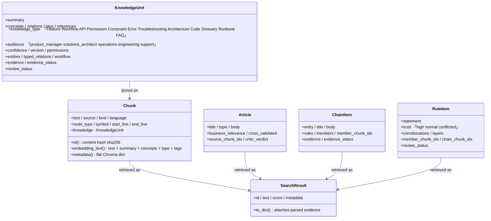

# openDomainMcp

> A **domain-knowledge workflow platform**. Point it at source code, documents,
> API specs, or a wiki export — it chunks them intelligently, uses an LLM to
> extract structured domain knowledge, embeds and indexes everything, builds a
> typed knowledge graph, distils higher-level articles and rules, gates quality
> through human review, and **publishes role-specific MCP servers** that ground
> AI agents in your domain — all driven from a **CLI**, **MCP tools**, or a
> **web console**.

Every surface runs on the same core: one `build_context()` assembles the
settings, vector store, pipeline, and graph store, so anything ingested from the
CLI is instantly searchable from the MCP server and the web console, and vice
versa. There is exactly one ingestion path and one retrieval path.



---

## Table of contents

- [Why this exists](#why-this-exists)
- [Key features](#key-features)
- [System architecture](#system-architecture)
- [The ingestion pipeline](#the-ingestion-pipeline)
- [Supported inputs](#supported-inputs)
- [The retrieval path (hybrid + unified)](#the-retrieval-path-hybrid--unified)
- [The "ask" path (RAG with citations)](#the-ask-path-rag-with-citations)
- [The knowledge quality layer](#the-knowledge-quality-layer)
- [The knowledge graph](#the-knowledge-graph)
- [MCP: generic server, role views, publishing](#mcp-generic-server-role-views-publishing)
- [The pre-execution advisor](#the-pre-execution-advisor)
- [Data model](#data-model)
- [Project layout](#project-layout)
- [Installation](#installation)
- [Quickstart — ingest ERPNext](#quickstart--ingest-erpnext)
- [Usage](#usage)
  - [CLI](#cli)
  - [MCP server](#mcp-server)
  - [Web console](#web-console)
- [HTTP API reference](#http-api-reference)
- [Configuration](#configuration)
- [Security model](#security-model)
- [Evals & benchmarks](#evals--benchmarks)
- [Testing](#testing)
- [Extensibility](#extensibility)
- [Design principles](#design-principles)

---

## Why this exists

Most "chat with your codebase" tools couple one UI to one storage backend and
one chunking strategy, and stop at retrieval. openDomainMcp treats
**ingestion → enrichment → quality control → publication** as one reusable core
and exposes it through interchangeable front ends:

| You want to… | Use the… |
| --- | --- |
| Script ingestion / search / graph builds in a terminal or CI | **CLI** (`opendomainmcp`) |
| Give an AI agent retrieval + graph + advisor tools | **MCP server** (`opendomainmcp-server`) |
| Give a *specific role* (PM, ops, dev, support, architect) a scoped toolset | **MCP views** (`opendomainmcp-view --view developer`) |
| Curate, review, measure, and publish knowledge in a browser | **Web console** (`opendomainmcp-web`) |

The differentiating idea: raw retrieval is not enough to ground agents. The
platform therefore layers **structured extraction** (typed knowledge with
audience, confidence, and evidence), a **knowledge graph** (entities, relations,
workflows, code dependencies), **distillation** (articles, call-chain analyses,
consolidated rules), and a **review + quality gate** before anything is
published to agents.

---

## Key features

- **AST-aware code chunking** via bundled tree-sitter grammars for 12 languages,
  with a line-window fallback for 7 more (including VB.NET and PL/SQL).
- **Spec-aware ingestion** — OpenAPI/Swagger (one chunk per operation), GraphQL
  SDL (one chunk per type / root field), MediaWiki XML exports, Git URLs
  (shallow-cloned), and `.zip` archives (zip-slip-guarded).
- **LLM knowledge extraction** — each chunk gets a `KnowledgeUnit` with summary,
  concepts, typed entities/relations, workflow steps, knowledge type, audience,
  confidence, and **verifiable evidence quotes**; extraction failures are
  recorded per chunk, never hidden.
- **Hybrid retrieval** — dense vectors + BM25 fused with Reciprocal Rank Fusion,
  then **unified fusion** with sibling article/chain collections and
  rule-over-member suppression, plus optional cross-encoder re-ranking.
- **Cited, streaming Q&A** — answers synthesized strictly from numbered
  sources with inline `[n]` citations, a configurable **relevance floor** that
  refuses to answer out-of-corpus questions, and optional **graph-context
  injection**.
- **Knowledge graph in MariaDB** — typed entities, relations, ordered
  workflows, and code import edges, deduplicated by normalized name and
  queryable from MCP tools, the API, and the web console.
- **Code graph + chain analysis** (`codegraph`) — a function-level call graph
  with an optional LLM pass that analyzes whole call chains instead of isolated
  chunks.
- **Consolidated rules** (`consolidate`) — a consensus pass that merges
  corroborating knowledge into trust-ranked rules (`high` / `normal` /
  `conflicted`).
- **Synthesized articles** (`synthesize`) — topic-level business-meaning
  articles drafted strictly from retrieved chunks, self-critiqued, and fused
  back into search and ask.
- **Human-in-the-loop review** — pending/approved/rejected states with audit
  history, batch review, evidence badges, and retrieval that can be gated to
  approved knowledge only.
- **Role-specific MCP views** — Product / Operations / Developer / Support /
  Architecture servers described as data and **published over HTTP (SSE) behind
  a quality gate** with auditable publish/unpublish decisions.
- **Pre-execution advisor** — a no-LLM aggregation answering *"what should I
  know before doing X?"* in five facets: workflow, risks, permissions,
  dependencies, constraints.
- **Agent simulator + metrics** — dry-run tasks against a view and measure the
  grounding agents actually receive; retrieval quality accumulates in metrics.
- **Multiple knowledge bases** — first-class Chroma collections, each with its
  own graph slice; optional **multi-tenant** namespacing and **API-key auth**
  with per-key view scoping.
- **Resilience + fail-loud** — timeouts and bounded retries on external calls;
  skipped files, extraction failures, and gate rejections are always reported.
- **Fully offline tests** — 735 tests across 103 files; deterministic fake
  embedder and extractor, in-memory Chroma, no network.

---

## System architecture

The surfaces are thin adapters. They all call `build_context()`, which
assembles a `Context { settings, store, pipeline, graph }` from `Settings`.
Dependencies (embedder, extractor, reranker, graph store) are **injected**,
which is what lets the whole stack run offline in tests by swapping in fakes.



---

## The ingestion pipeline

`Pipeline.ingest_path()` accepts a file, directory, Git URL, `.zip`, OpenAPI /
GraphQL spec, or MediaWiki export. Each file runs through the stages below; a
`progress` callback emits an event per stage (`fetch`, `load`, `split`,
`extract`, `prune`, `embed`, `store`, `skip`, `error`, `filter`, `done`), which
the CLI and web console stream live.

```mermaid
flowchart TD
    START["ingest_path(path | git URL | zip, sync?, exclude?)"]
    START --> FETCH["FETCH · sources.py<br/>git clone --depth 1 / safe zip extract → data_dir/.sources (confined as allowed_root)"]
    FETCH --> WALK["WALK<br/>confine to ingest_root (symlink-safe) · skip dotfiles, .git, node_modules, … · apply exclude globs"]
    WALK --> LOAD["1 · LOAD · loader.py — detect type by extension<br/>code → tree-sitter · pdf/docx/html → text · OpenAPI/GraphQL → api · MediaWiki → text · UTF-8 passthrough · binary → skip (reported)"]
    LOAD --> SPLIT["2 · SPLIT<br/>code → code_splitter (AST boundaries, line-window fallback)<br/>api → per-operation / per-type · text → recursive splitter with overlap"]
    SPLIT --> PRUNE["PRUNE<br/>drop stored chunks of this source whose ids vanished (+ their graph slice)"]
    PRUNE --> EXTRACT["3 · EXTRACT · extract/knowledge.py<br/>KnowledgeUnit per chunk (ThreadPoolExecutor) · evidence verified against the chunk text<br/>review_mode → born pending · per-chunk failures recorded (Fail Loud)"]
    EXTRACT --> EMBED["4 · EMBED + 5 · STORE<br/>embedding_text() = text + summary + concepts + type + tags → embed → ChromaStore.upsert()<br/>id = content hash → idempotent re-ingest"]
    EMBED --> GWRITE["GRAPH WRITE<br/>entities + typed relations (builder) · import edges (deps) · workflow steps (workflow)"]
    GWRITE --> REPORT["IngestReport<br/>files_indexed · chunks_indexed · chunks_pruned · skipped · errors · filtered · evidence_verified/unverified"]
    REPORT -.->|"sync && directory"| SYNC["remove chunks for source files no longer on disk"]
```



**Why enrich before embedding?** `Chunk.embedding_text()` appends the extracted
summary, concepts, knowledge type, and tags to the raw text. A query like *"how
does retry/backoff work"* then matches a function whose code never contains
those words but whose summary does.

**Idempotency:** a chunk's `id` is a sha256 of `source:start-end` plus the
text. Re-ingesting unchanged content upserts the same ids — a no-op. Changed
content yields new ids and the stale ones (plus their graph slice) are pruned.

**Ingestion modes beyond the basics:**

- `--sync` on a directory also removes chunks for files deleted from disk.
- `ODM_EXTRACT_BATCH` routes extraction through the Anthropic Message Batches
  API with caching.
- `ODM_CODEGRAPH_EXTRACT` defers per-chunk code extraction to the
  [chain-analysis pass](#the-knowledge-quality-layer).
- The web console can run ingestion as a **resumable background job**
  (`POST /api/ingest/async`) with checkpointing and cancellation.

---

## Supported inputs

**Code — AST chunking (bundled tree-sitter grammars):** Python,
JavaScript (+JSX), TypeScript, TSX, Java, Go, Rust, C, C++, C#, Ruby, Bash.

**Code — line-window fallback (recognized, no bundled grammar):** PHP, Swift,
Kotlin, Scala, Lua, **VB.NET** (`.vb`), **PL/SQL** (`.sql`, `.pks`, `.pkb`,
`.pls`).

**API specs:** OpenAPI / Swagger (`.json` / `.yaml` with `openapi`/`swagger` +
`paths`) → one chunk per operation with resolved `$ref`s, pre-classified as
`knowledge_type=API`; GraphQL SDL (`.graphql` / `.graphqls` / `.gql`) → one
chunk per type, root types exploded per field.

**Documents:** `txt`, `md`, `rst`, `pdf`, `docx`, `html`, `json`, `yaml`,
`csv`/`tsv`, `xml`, `toml`, `ini`, `cfg`, `css`, `log`, and **any file that
decodes as UTF-8**. MediaWiki XML exports are flattened into per-page sections.
Binary / non-UTF-8 files are skipped and reported, never silently dropped.

**Source specs:** local file or directory, Git URL (GitHub / GitLab /
Bitbucket / `git@…` / `*.git`, shallow-cloned), `.zip` archive.

---

## The retrieval path (hybrid + unified)

`ChromaStore.search()` runs dense and lexical retrieval independently and fuses
them with RRF. On top of that, `search_unified()` — used by `ask`, `/api/search`
and the views — fuses in the sibling **articles** and **chains** collections and
prefers consolidated **rules** over their member chunks.



- **`mode="vector"`** skips the lexical branch entirely (pure dense,
  `score = 1 − cosine distance`).
- **Approval gating**: with `ODM_RETRIEVE_APPROVED_ONLY=true`, view tools and
  the advisor add `review_status=approved` to every query — unreviewed
  knowledge never reaches published agents.
- **Re-ranking** is off by default (downloads a model on first use). When on,
  it also gives lexical-only hits a real relevance score.

---

## The "ask" path (RAG with citations)

`ask` layers answer synthesis on top of unified retrieval. The LLM is
instructed to answer *strictly* from the numbered sources and cite them inline
as `[n]`.



Without an API key it **fails loudly** with a clear error instead of
fabricating. The relevance floor exists because benchmarking showed that
without it, every out-of-corpus "negative control" question produced a
confident fabricated answer.

---

## The knowledge quality layer

Retrieval quality is treated as a product surface, not an afterthought. Four
mechanisms stack on top of raw extraction:

**Evidence verification.** Every extracted claim can carry evidence quotes;
during ingest each quote is verified against the actual chunk text and the
result (`evidence_status`) is stored on the chunk and surfaced as badges in
review. The ingest report counts verified vs. unverified evidence.

**Review workflow.** With `ODM_REVIEW_MODE=true`, newly extracted knowledge is
born `pending`. The Review page (and `/api/items/*` endpoints) approve / reject
individually or in batch, with a per-item **audit history**; hand-authored
knowledge is stored born-approved. `ODM_RETRIEVE_APPROVED_ONLY` then gates
published retrieval to approved items. High-trust verified rules can be
auto-approved (`ODM_REVIEW_AUTO_APPROVE_HIGH_TRUST`).

**Code graph + chain analysis (`codegraph`).** Builds a function-level call
graph from the source, then an optional `--analyze` LLM pass walks whole call
chains (depth-capped) instead of isolated chunks — backfilling summaries and
producing **ChainItem** documents in a sibling `<collection>__chains` store
that retrieval fuses in.

**Consolidated rules (`consolidate`).** A consensus pass clusters
corroborating knowledge across layers (cosine floor
`ODM_CONSENSUS_SIMILARITY_THRESHOLD`, default 0.80) into **RuleItem**s with a
trust level (`high` / `normal` / `conflicted`) and back-references to member
chunks. Retrieval prefers a rule over re-surfacing all its members.

**Synthesized articles (`synthesize`).** Aggregates candidate topics from
extracted concepts, gates out thin ones, drafts one concise business-meaning
article per topic **strictly from retrieved chunks**, then self-critiques each
draft (relevance score + cross-validation) before storing to
`<collection>__articles`. Rejected drafts are reported, not silently dropped.

```bash
opendomainmcp --collection erpnext synthesize            # all gated topics
opendomainmcp --collection erpnext synthesize --limit 6  # cap topics (cost control)
opendomainmcp --collection erpnext synthesize --dry-run  # critique only, store nothing
opendomainmcp --collection erpnext codegraph ./src --persist --analyze
opendomainmcp --collection erpnext consolidate
```

The web console's **Quality Lab** page rolls these signals (evidence, review
state, validation scenarios) into a readiness verdict per knowledge base, and
the **MCP Publish** gate consumes it.

---

## The knowledge graph

Extracted entities, typed relations, workflows, and code import edges are
persisted in **MariaDB** (`MariaGraphStore` via PyMySQL; `NullGraphStore` is a
no-op for graph-less local demos — `ODM_GRAPH_STORE_BACKEND=null`). Every table
is keyed by collection, so each knowledge base has an isolated graph slice that
is pruned alongside its chunks.



- **Built during ingest**: `builder.py` maps each chunk's typed
  entities/relations, `deps.py` adds `imports` edges from real import
  statements (tree-sitter or regex fallback for Python and JS/TS), and
  `workflow.py` assembles ordered steps with preconditions.
- **Deduplication** is by normalized name with idempotent upserts that keep the
  highest confidence seen.
- **Consumed by**: the graph MCP tools (`get_entity`, `list_related_entities`,
  `get_workflow_steps`, `list_workflows`), the `/api/graph/*` endpoints and
  Graph page, the advisor's dependency facet, `trace_dependency` in the
  Developer view, and (optionally) `ask` via graph-context injection.
- **Measured by**: structural quality metrics (`evals/graph_metrics.py`) —
  extraction coverage, orphan ratio, connectivity, duplication clustering, and
  concept recall against a golden set.

---

## MCP: generic server, role views, publishing

### Generic server

`opendomainmcp-server` (stdio) exposes six tools, each accepting an optional
`collection`:

| Tool | Purpose |
| --- | --- |
| `ingest_path(path, sync?, collection?)` | Ingest a file/dir/URL; returns indexed/pruned counts and errors |
| `search_knowledge(query, top_k?, kind?, language?, symbol?, collection?)` | Hybrid search with filters |
| `ask(query, top_k?, collection?)` | Cited answer (`{error: …}` if no API key) |
| `what_should_i_know_before(action, top_k?, collection?)` | Pre-execution advisor (five facets) |
| `get_stats(collection?)` | Count, embedder, dimension |
| `list_collections()` | All knowledge bases with chunk counts |

### Role views

Five role-specific servers are **described as data** in `views.VIEWS` (tool
name + knowledge-type/audience/node-type filters) and turned into real FastMCP
servers by `build_view_server()` — each tool is a filtered search over the same
shared store. Select with `opendomainmcp-view --view NAME` or `ODM_MCP_VIEW`.

| View | Search tools | Graph tools |
| --- | --- | --- |
| **product** | `get_feature`, `get_workflow`, `get_constraint`, `search_product_knowledge` | `get_workflow_steps` |
| **operations** | `get_runbook`, `get_troubleshooting`, `get_incident_response`, `get_rollback_procedure` | `get_workflow_steps`, `list_workflows` |
| **developer** | `search_code`, `get_class`, `get_function`, `trace_dependency`, `get_api_implementation` | `get_entity`, `list_related_entities` |
| **support** | `get_known_issue`, `get_error_explanation`, `get_resolution_steps`, `search_faq` | — |
| **architecture** | `get_component`, `get_dependency`, `get_dataflow`, `search_architecture` | `get_entity`, `list_related_entities` |

`trace_dependency` consults the code dependency graph first (`imports`
neighbors) and falls back to code search. With `ODM_RETRIEVE_APPROVED_ONLY`,
every view tool returns approved knowledge only.

### Publishing over HTTP

The web API mounts every view as a **live SSE MCP endpoint** at `/mcp/{view}`.
Publishing is controlled per view via `/api/mcp/endpoints`:

- `POST` publishes a view **behind a quality gate** — if the knowledge base
  fails the gate the publish is refused with `409` unless explicitly
  overridden, and every decision (with its evidence) is persisted as history.
- `DELETE` unpublishes. The MCP Publish page drives this flow and also
  configures the retrieval policy (approved-only, re-ranking, hybrid/vector).
- The **Agent Simulator** (`POST /api/simulate` / Simulator page) dry-runs a
  task against one view and reports the grounding an agent would receive —
  hits, average score, knowledge types, per-tool breakdown. Zero hits means an
  agent would be ungrounded for that task under that view.

---

## The pre-execution advisor

`what_should_i_know_before(action)` (MCP) / `POST /api/advise` (HTTP) / the
Advisor page answer one question: *"I'm about to do X — what must I know
first?"* It is a **pure aggregation — no LLM calls** — over retrieval plus the
knowledge graph, returning five facets:

| Facet | Sourced from |
| --- | --- |
| **Workflow** | `Workflow` + `Runbook` knowledge, plus the best-matching graph workflow's ordered steps |
| **Risks** | `Error`, `Troubleshooting`, `Constraint` knowledge |
| **Permissions** | `Permission` knowledge |
| **Dependencies** | graph `imports` / `depends_on` neighbors, merged with `Architecture` knowledge |
| **Constraints** | `Constraint` knowledge |

Results are deduplicated, honor approval gating, and come with a per-facet
count summary — cheap enough to call before *every* agent action.

---

## Data model

Plain dataclasses (`models.py`) carry no business logic, keeping pipeline
stages decoupled. Articles, chains, and rules duck-type the same store contract
as chunks (`id` / `text` / `embedding_text` / `metadata`), which is what lets
one vector store hold all four.



---

## Project layout

```
openDomainMcp/
├── src/opendomainmcp/
│   ├── context.py              # build_context(): the single wiring point
│   ├── config.py               # Settings (ODM_* env + .env + settings.json overlay)
│   ├── models.py               # Chunk / KnowledgeUnit / SearchResult / Article / ChainItem / RuleItem
│   ├── cli.py                  # CLI entry point       → `opendomainmcp`
│   ├── server.py               # MCP entry point       → `opendomainmcp-server` / `opendomainmcp-view`
│   ├── views/                  # 5 role views described as data (VIEWS)
│   ├── advisor/                # pre-execution advisor (pure aggregation, no LLM)
│   ├── ingest/
│   │   ├── loader.py           #   type detection + document/spec text extraction
│   │   ├── code_splitter.py    #   tree-sitter AST chunking (+ line-window fallback)
│   │   ├── text_splitter.py    #   recursive text chunking with overlap
│   │   ├── openapi.py          #   OpenAPI → one chunk per operation
│   │   ├── graphql.py          #   GraphQL SDL → one chunk per type/root field
│   │   ├── wiki.py             #   MediaWiki XML → per-page text
│   │   ├── sources.py          #   Git URL / zip materialization (confined)
│   │   └── pipeline.py         #   orchestration + prune/sync + graph writes + progress
│   ├── extract/knowledge.py    # Anthropic / OpenAI-compatible / Null extractors
│   ├── embedding/              # base + local (fastembed) + cloud (openai / voyage)
│   ├── store/chroma_store.py   # Chroma vector store + collections admin
│   ├── retrieval/              # lexical (BM25 + RRF) · unified fusion · rerank
│   ├── query/                  # rag.py (cited sync/stream answers) · graph_context.py
│   ├── graph/                  # MariaDB graph store · builder · deps · workflow · normalize
│   ├── evals/                  # offline grounding/hallucination harness + graph metrics
│   └── api/                    # FastAPI app · auth · sources · insights · MCP endpoints · observability
├── web/                        # React + Vite + Tailwind SPA (built into api/static/)
│   └── src/pages/              # 14 routed pages (see Web console)
├── benchmarks/erpnext/         # pinned retrieval/RAG regression benchmark (32 questions)
├── tests/                      # 735 offline tests across 103 files
├── docs/                       # guides (ARCHITECTURE / FEATURES / PRD …) + screenshots
├── pyproject.toml              # deps + console-script entry points
└── .env.example                # every ODM_ setting documented
```

---

## Installation

**Backend (Python ≥ 3.11):**

```bash
python -m venv .venv && source .venv/bin/activate
pip install -e ".[dev]"
cp .env.example .env          # adjust as needed
```

The local embedder downloads a small model (`BAAI/bge-small-en-v1.5`, 384-dim)
from HuggingFace on first use — no GPU or torch required. Knowledge extraction
and `ask` default to the Anthropic API (`ANTHROPIC_API_KEY` /
`ANTHROPIC_BASE_URL`); set `ODM_LLM_BACKEND=openai` for any OpenAI-compatible
endpoint, or `ODM_EXTRACT_KNOWLEDGE=false` to ingest without an LLM.

The knowledge graph wants a MariaDB (`ODM_GRAPH_DB_*`). For a graph-less local
demo, run with `ODM_GRAPH_STORE_BACKEND=null` — everything else works.

### Free local-first setup (local ingest + cloud `ask`)

Keep **ingest fully local** and send only the occasional `ask` to a free cloud
LLM. Any Anthropic-compatible endpoint works via `ANTHROPIC_BASE_URL` (e.g.
[OpenRouter](https://openrouter.ai)); fully local extraction via an
OpenAI-compatible server (LM Studio, Ollama) works via `ODM_LLM_BACKEND=openai`.

```bash
# Ingest stays local: embeddings only, no API calls, unlimited & offline.
ODM_EXTRACT_KNOWLEDGE=false
ODM_EMBEDDER_BACKEND=local

# `ask` runs on the cloud via an Anthropic-compatible endpoint (OpenRouter shown).
ODM_ANSWER_MODEL=openai/gpt-oss-120b:free
ANTHROPIC_BASE_URL=https://openrouter.ai/api
ANTHROPIC_API_KEY=sk-or-...        # sent as the x-api-key header
```

| Operation | Runs on | Cost |
| --- | --- | --- |
| Ingest (chunk + embed) | local (fastembed) | free, unlimited, offline |
| Search / Explore (hybrid) | local | free, unlimited, offline |
| Ask (cited Q&A) | cloud LLM | free tier |

To also extract knowledge during ingest, point `ODM_EXTRACTION_MODEL` (and
optionally `ODM_EXTRACT_BASE_URL` / `ODM_EXTRACT_PROVIDER`) at your endpoint —
keep `ODM_EXTRACT_CONCURRENCY` low on local or free-tier backends.

**Frontend (optional — only to rebuild the dashboard):**

```bash
cd web
npm install
npm run build      # outputs to src/opendomainmcp/api/static/, served by opendomainmcp-web
# or: npm run dev  # Vite dev server, proxies /api → 127.0.0.1:8000
```

---

## Quickstart — ingest ERPNext

A concrete end-to-end run using **[ERPNext](https://github.com/frappe/erpnext)**,
the open-source ERP. Each step targets a dedicated `erpnext` collection so it
stays isolated from your other knowledge bases.

```bash
# 1. Ingest ERPNext straight from GitHub. The Git URL is shallow-cloned under
#    <data_dir>/.sources/, confined as the allowed root, then chunked,
#    enriched, embedded, and stored — with live per-file progress.
opendomainmcp --collection erpnext ingest https://github.com/frappe/erpnext

#    (Or ingest a local checkout; --sync prunes chunks for deleted files.)
opendomainmcp --collection erpnext ingest ./erpnext --sync

# 2. Hybrid search (dense + BM25, RRF-fused) across the knowledge base.
opendomainmcp --collection erpnext search "how is a sales order validated" --top-k 5

# 3. Ask a cited question — answered strictly from retrieved chunks with
#    inline [n] citations (needs an LLM key).
opendomainmcp --collection erpnext ask "what happens when a sales order is submitted?"

# 4. Distill and consolidate.
opendomainmcp --collection erpnext synthesize --limit 6
opendomainmcp --collection erpnext consolidate

# 5. Inspect what landed.
opendomainmcp --collection erpnext stats
```

Then open the web console (`opendomainmcp-web`), pick `erpnext` from the
knowledge-base switcher, and explore, review, and publish it as MCP views.

---

## Usage

### CLI

```bash
opendomainmcp ingest ./path-or-url            # file / dir / git URL / zip / spec; --sync, --exclude GLOB
opendomainmcp search "query" --top-k 5        # --kind code|text --language X --symbol Y --source Z
opendomainmcp ask "question"                  # streamed cited answer (needs LLM key)
opendomainmcp stats                           # collection statistics
opendomainmcp collections                     # list knowledge bases
opendomainmcp --collection my_kb ingest ./src # target a specific knowledge base
opendomainmcp synthesize [--limit N] [--dry-run]
opendomainmcp codegraph ./src [--persist] [--analyze] [--json]
opendomainmcp consolidate [--json]
opendomainmcp backfill-review [--status approved] [--all]
opendomainmcp clear                           # delete all indexed content in the collection
```

Search is **hybrid** by default; set `ODM_SEARCH_MODE=vector` for dense-only.

### MCP server

```bash
opendomainmcp-server                       # generic server, stdio
opendomainmcp-view --view developer        # role view, stdio (or ODM_MCP_VIEW=developer)
```

Point any MCP client at the command over stdio, or publish views over HTTP SSE
from the web console (`/mcp/{view}`). Tool lists are in
[MCP: generic server, role views, publishing](#mcp-generic-server-role-views-publishing).

### Web console

```bash
opendomainmcp-web                              # http://127.0.0.1:8000
ODM_GRAPH_STORE_BACKEND=null opendomainmcp-web # graph-less local demo (no MariaDB)
```

A React SPA served by FastAPI. The sidebar's **knowledge-base switcher**
creates, deletes, and switches collections (persisted in `localStorage`, sent
on every request via the `X-Collection` header); a theme toggle sits at the
bottom. Pages are grouped by workflow stage:

| Group | Page | What it does |
| --- | --- | --- |
| — | **Command Center** | Lifecycle status, blockers, and the recommended next action for the active knowledge base |
| Knowledge | **Source Intake** | Add server paths, upload files, run background/streamed ingestion, manage indexed sources |
| Knowledge | **Explore** | Hybrid semantic + keyword search with `kind` / `language` / `source` filters |
| Knowledge | **Ask** | Cited Q&A, streamed token-by-token, with clickable typed sources |
| Knowledge | **Browse / Edit** | Page through stored chunks; edit metadata; delete items |
| Knowledge | **Articles** | Synthesized business-meaning articles with their grounding sources |
| Quality | **Review** | Approve / reject / hand-author knowledge; evidence badges; audit history |
| Quality | **Quality Lab** | Evidence, gates, and validation signals rolled into a readiness verdict |
| Quality | **Graph** | Browse entities, relations (ego-network view), and ordered workflows |
| Quality | **Metrics** | Product metrics (published MCPs, knowledge objects, sources) + agent grounding metrics |
| Publish | **Advisor** | The five-facet pre-execution advisor |
| Publish | **MCP Publish** | Retrieval policy + publish/unpublish views behind the quality gate, with decision history |
| Publish | **Simulator** | Dry-run a task against a view and inspect the grounding it returns |
| — | **Settings** | Runtime-editable configuration, persisted to `settings.json` |

Screenshots of every page live in
[`docs/screenshots/`](docs/screenshots) (gallery: `docs/screenshots.html`).

---

## HTTP API reference

The web console is a thin client over these endpoints. All accept an optional
`?collection=` query param or `X-Collection` header; when auth is enabled they
require `X-API-Key`.

| Method & path | Purpose |
| --- | --- |
| `GET  /api/health` | Rich health payload (store count, embedder, graph probe, version) |
| `GET  /api/stats` | Count, embedder, dimension, data dir, extraction flag |
| `POST /api/search` | Unified hybrid search (records a retrieval metric) |
| `POST /api/ask` · `GET /api/ask/stream` | Cited answer, blocking / SSE-streamed |
| `POST /api/upload` | Multipart upload, streamed to disk, size-capped (`413`) |
| `GET  /api/ingest/stream` | Ingest a path with per-stage SSE progress |
| `POST /api/ingest/async` · `GET/DELETE /api/ingest/jobs/{id}` | Resumable background ingest jobs (checkpointed, cancellable) |
| `GET  /api/synthesize/stream` | Stream article synthesis (`409` if a run is active) |
| `GET  /api/articles` | List synthesized articles |
| `GET/POST /api/items` · `GET/PATCH/DELETE /api/items/{id}` | Browse / author / edit / delete knowledge items |
| `POST /api/items/{id}/approve` · `/reject` · `/api/items/review-batch` | Review actions (audited, principal-attributed) |
| `GET  /api/items/{id}/history` | Review audit history |
| `GET/DELETE /api/sources` | List sources / delete a source's chunks + graph slice |
| `GET/PATCH /api/settings` | Read / persist runtime-editable settings |
| `GET/POST /api/collections` · `DELETE /api/collections/{name}` | Manage knowledge bases (delete drops the graph slice too) |
| `GET  /api/graph/entities` · `/api/graph/entity/{name}` | Search entities / entity + neighbors |
| `GET  /api/graph/workflows` · `/api/graph/workflow/{name}` | List workflows / ordered steps |
| `POST /api/advise` | Five-facet pre-execution advice |
| `GET  /api/views` | List MCP views with tools + filters |
| `POST /api/simulate` | Agent Simulator (RBAC-checked per view) |
| `GET/POST /api/mcp/endpoints` · `DELETE /api/mcp/endpoints/{view}` | List / publish (quality-gated, `409`) / unpublish views |
| `GET  /api/metrics` | Product + agent grounding metrics |
| *(mount)* `/mcp/{view}` | Live SSE MCP transport per published view |

Streaming endpoints bridge blocking calls onto the event loop via
`asyncio.to_thread` and surface failures as `error` events (Fail Loud). Every
request is logged with method, path, status, and duration.

---

## Configuration

All settings use the `ODM_` prefix, read from env / `.env` (`config.py`). A
subset is **runtime-editable** from the web UI and persisted to
`<data_dir>/settings.json` (layered over env at load). Credentials, `data_dir`,
graph DB, and auth settings are deliberately env-only. The full documented list
lives in `.env.example`; the highlights:

| Setting | Default | UI-editable | Description |
| --- | --- | :---: | --- |
| `ODM_DATA_DIR` | `.opendomain` | | Chroma store + `settings.json` + uploads + staged sources |
| `ODM_COLLECTION_NAME` | `domain_knowledge` | | Default knowledge base |
| `ODM_INGEST_ROOT` | *(unset)* | | Confine ingestion to this tree (symlink-safe) |
| `ODM_INGEST_EXCLUDE` | *(empty)* | ✅ | Extra exclude globs on top of built-in defaults |
| `ODM_MAX_UPLOAD_MB` | `50` | | Reject larger web uploads |
| `ODM_EMBEDDER_BACKEND` / `_MODEL` | `local` / `bge-small-en-v1.5` | ✅ | `local` \| `openai` \| `voyage` |
| `ODM_LLM_BACKEND` | `anthropic` | | `anthropic` \| `openai` (any OpenAI-compatible endpoint) |
| `ODM_EXTRACT_KNOWLEDGE` | `true` | ✅ | Enable LLM knowledge extraction |
| `ODM_EXTRACTION_MODEL` | `claude-sonnet-4-6` | ✅ | Extraction model (`ODM_EXTRACT_PROVIDER` / `_BASE_URL` to override endpoint) |
| `ODM_EXTRACT_CONCURRENCY` | `8` | ✅ | Parallel extraction calls per file |
| `ODM_EXTRACT_BATCH` | `false` | ✅ | Anthropic Message Batches extraction |
| `ODM_CHUNK_SIZE` / `_OVERLAP` | `1200` / `150` | ✅ | Text chunking |
| `ODM_CODE_MAX_CHUNK_CHARS` | `2000` | ✅ | AST chunk size ceiling |
| `ODM_SEARCH_MODE` | `hybrid` | ✅ | `hybrid` (dense+BM25) \| `vector` |
| `ODM_RERANK_ENABLED` | `false` | ✅ | Cross-encoder re-ranking after fusion |
| `ODM_ANSWER_MODEL` | `claude-sonnet-4-6` | ✅ | RAG answer model |
| `ODM_REVIEW_MODE` | `false` | ✅ | New knowledge born `pending` |
| `ODM_RETRIEVE_APPROVED_ONLY` | `false` | ✅ | Views/advisor return approved knowledge only |
| `ODM_RETRIEVE_MIN_SCORE` | `0.0` | ✅ | Relevance floor for `ask` (0 = off) |
| `ODM_RETRIEVE_INCLUDE_ARTICLES` / `_CHAINS` | `true` | ✅ | Fuse sibling collections into retrieval |
| `ODM_RETRIEVE_PREFER_RULES` | `true` | ✅ | Suppress chunks covered by a retrieved rule |
| `ODM_RETRIEVE_INCLUDE_GRAPH` | `false` | ✅ | Inject graph context into `ask` |
| `ODM_CODEGRAPH_EXTRACT` | `false` | ✅ | Defer code extraction to the chain-analysis pass |
| `ODM_GRAPH_STORE_BACKEND` | `mariadb` | | `mariadb` \| `null`; `ODM_GRAPH_DB_HOST/PORT/USER/PASSWORD/NAME` |
| `ODM_AUTH_ENABLED` / `ODM_API_KEYS` | `false` / — | | API-key auth; keys as `key:role:views` (views `*` or `\|`-list) |
| `ODM_MULTI_TENANT` | `false` | | Require `X-Tenant` and namespace collections per tenant |
| `ODM_REQUEST_TIMEOUT` / `ODM_MAX_RETRIES` | `60` / `2` | | Resilience on external API + store calls |

**Credentials** come from standard provider vars — `ANTHROPIC_API_KEY` /
`ANTHROPIC_BASE_URL`, `OPENAI_API_KEY` / `OPENAI_BASE_URL`, `VOYAGE_API_KEY` —
plus `ODM_GRAPH_DB_PASSWORD` and `ODM_API_KEYS`.

---

## Security model

When exposing the web or MCP server beyond a trusted machine:

- **`ODM_INGEST_ROOT`** confines ingestion to a directory tree. Paths are
  resolved (following symlinks) and rejected if they escape — both the
  requested path and every file discovered during a walk. Remote sources
  (Git / zip) are materialized under `<data_dir>/.sources/` and confined there;
  zip extraction guards against zip-slip.
- **`ODM_MAX_UPLOAD_MB`** caps uploads, streamed to disk in chunks and aborted
  with `413` the moment the limit is exceeded.
- **API-key auth** (`ODM_AUTH_ENABLED` + `ODM_API_KEYS`) protects the API and
  published MCP endpoints via `X-API-Key`, with **per-key view scoping**
  (`key:role:views`) enforced on simulation and view access; review actions are
  attributed to the authenticated principal in the audit history. Malformed key
  specs fail loudly at startup.
- **`ODM_MULTI_TENANT`** requires an `X-Tenant` header and namespaces
  collections per tenant.
- **Noise/secrets filter:** the walker skips dotfiles and common heavy/private
  directories (`.git`, `node_modules`, `.venv`, `dist`, `build`, …), plus any
  `ODM_INGEST_EXCLUDE` globs.

---

## Evals & benchmarks

- **`evals/`** — an offline grounding/hallucination harness with injected
  callables (no network): `retrieval_hit_rate` (did an expected source
  surface?) and `answer_grounding_rate` (does the answer contain the expected
  facts?), plus structural **graph quality metrics** (extraction coverage,
  orphan ratio, connectivity, duplication clustering, concept recall).
- **`benchmarks/erpnext/`** — a repeatable regression benchmark on pinned
  ERPNext accounting source: 32 questions across 8 categories (numeric
  calculation, business rules, workflow sequences, exception handling, edge
  cases, definitions, graph relations, and **negative controls**), with
  idempotent corpus setup and per-category reports. The negative controls are
  what motivated the `ask` relevance floor: without it, every out-of-corpus
  question produced a confident fabricated answer.

---

## Testing

```bash
pytest                    # full suite — fully offline
pytest -m integration     # graph/MariaDB tests (need live ODM_GRAPH_DB_* env)
cd web && npm run test:e2e  # Playwright, mocked API
```

**735 tests across 103 files**, all offline by default: a deterministic
FakeEmbedder (hashed bag-of-words so token overlap drives similarity) and a
FakeExtractor stand in for the network, and Chroma runs in-memory. MariaDB
integration tests are opt-in via the `integration` marker. The frontend has 9
Playwright specs covering every page against a mocked API.

---

## Extensibility

The injection seams make extension localized:

- **New embedder** → implement `Embedder` (`embed` + `dim`), register in
  `embedding/__init__.py:get_embedder()`.
- **New language** → add the extension→language mapping in `loader.py` and the
  grammar in `code_splitter.py:_GRAMMARS` (plus the tree-sitter wheel in
  `pyproject.toml`); without a grammar you still get line-window chunking.
- **New extractor** → implement `extract(text, kind, language) -> KnowledgeUnit`,
  return it from `get_extractor()`.
- **New MCP view or view tool** → add a `ViewTool` entry to `views.VIEWS` —
  data, not code; the server, HTTP mount, publish gate, and simulator pick it
  up automatically.
- **New surface** → call `build_context()` and drive `ctx.pipeline` /
  `ctx.store` / `ctx.graph`; you inherit ingestion, hybrid retrieval, RAG, and
  the graph for free.

---

## Design principles

This codebase follows the conventions in `CLAUDE.md`:

- **One source of truth** — every surface flows through `build_context()`;
  behavior changes happen in the core, never per-surface.
- **Fail loud** — skipped files, extraction failures, unverifiable evidence,
  missing API keys, and failed quality gates are reported explicitly, never
  silently swallowed.
- **Simplicity first** — the text splitter, BM25 fusion, and advisor are small
  in-house implementations rather than heavy dependencies; views are plain
  data.
- **Dependency injection** — store, extractor, embedder, reranker, and graph
  store are injected, which is exactly what lets 735 tests run offline.

---

## License

MIT.
